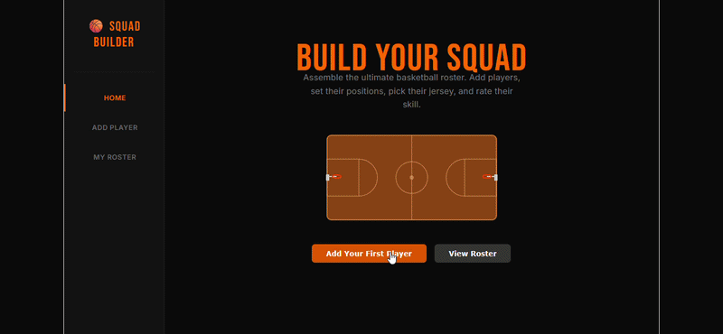

# Web Development - Squad Builder

This web app: **A basketball-themed crewmate creator that lets users build their ultimate roster. Users can add players, set their position, jersey color, and skill rating, then view, edit, and delete them through a full CRUD interface powered by Supabase and React.**

## Required Features

The following **required** functionality is completed:

- [x] **The web app contains a page that features a create form to add a new crewmate**
  - Users can name the crewmate
  - Users can set the crewmate's attributes by clicking on one of several values
- [x] **The web app includes a summary page of all the user's added crewmatese**
  - The web app contains a summary page dedicated to displaying all the crewmates the user has made so far
  - The summary page is sorted by creation date such that the most recently created crewmates appear at the top
- [x] **A previously created crewmate can be updated from the list of crewmates in the summary page**
  - Each crewmate has an edit button that will take users to an update form for the relevant crewmate
  - Users can see the current attributes of their crewmate on the update form
  - After editing the crewmate's attribute values using the form, the user can immediately see those changes reflected in the update form and on the summary page
- [x] **A previously created crewmate can be deleted from the crewmate list**
  - Using the edit form detailed in the previous _crewmates can be updated_ feature, there is a button that allows users to delete that crewmate
  - After deleting a crewmate, the crewmate should no longer be visible in the summary page
  - [x] **Each crewmate has a direct, unique URL link to an info page about them**
    - Clicking on a crewmate in the summary page navigates to a detail page for that crewmate
    - The detail page contains extra information about the crewmate not included in the summary page
    - Users can navigate to the edit form from the detail page

The following **additional** features are implemented:

* [x] Basketball-themed UI with custom player icons, orange/black color scheme, and court graphics
* [x] Live player preview on the create and edit forms showing jersey color and position in real time
* [x] Skill rating system with Bronze, Silver, Gold, and Elite tiers with color-coded badges

## Video Walkthrough

Here's a walkthrough of implemented user stories:

## Notes

The main challenge was setting up Supabase with the correct column names and disabling Row Level Security to allow anonymous read/write access during development.

## License

    Copyright 2026 Wesley Theodore

    Licensed under the Apache License, Version 2.0 (the "License");
    you may not use this file except in compliance with the License.
    You may obtain a copy of the License at

        http://www.apache.org/licenses/LICENSE-2.0

    Unless required by applicable law or agreed to in writing, software
    distributed under the License is distributed on an "AS IS" BASIS,
    WITHOUT WARRANTIES OR CONDITIONS OF ANY KIND, either express or implied.
    See the License for the specific language governing permissions and
    limitations under the License.
